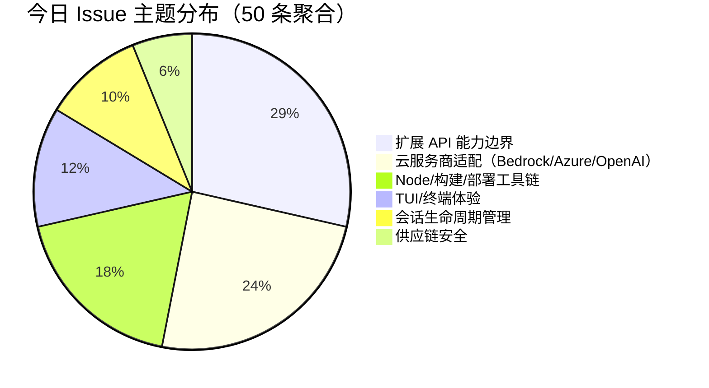

# AI CLI 工具社区动态日报 2026-05-22

> 生成时间: 2026-05-22 00:25 UTC | 覆盖工具: 9 个

- [Claude Code](https://github.com/anthropics/claude-code)
- [OpenAI Codex](https://github.com/openai/codex)
- [Gemini CLI](https://github.com/google-gemini/gemini-cli)
- [GitHub Copilot CLI](https://github.com/github/copilot-cli)
- [Kimi Code CLI](https://github.com/MoonshotAI/kimi-cli)
- [OpenCode](https://github.com/anomalyco/opencode)
- [Pi](https://github.com/badlogic/pi-mono)
- [Qwen Code](https://github.com/QwenLM/qwen-code)
- [DeepSeek TUI](https://github.com/Hmbown/DeepSeek-TUI)
- [Claude Code Skills](https://github.com/anthropics/skills)

---

## 横向对比

好的，作为专注于 AI 开发工具生态的资深技术分析师，我将基于您提供的日报数据，生成一份横向对比分析报告。

---

### **AI CLI 工具生态横向对比分析报告 (2026-05-22)**

#### **1. 生态全景**

当前 AI CLI 工具生态正经历 **“从功能可用到生产就绪”** 的激烈竞争阶段。一方面，各工具通过快速迭代新功能和模型接入来抢占市场（如 Goals、Daemon 模式、MCP 集成）；另一方面，**稳定性与可靠性**已成为社区最主要的呼声，从 Claude Code 的 Bash 回归漏洞到 Codex 的 Windows 启动崩溃，再到 Qwen Code 的内存泄漏，都表明产品质量（尤其是长会话处理、跨平台兼容性）是当前最大的挑战。企业级需求（如 OAuth 生命周期管理、审计钩子、模型路由策略）正在从“加分项”变为“必选项”，推动工具向更成熟的平台演进。

#### **2. 各工具活跃度对比**

| 工具名称 | 今日版本发布 | 热点 Issue (≥10 评论) | 重要 PR 进展 | 社区核心焦点 |
| :--- | :--- | :--- | :--- | :--- |
| **Claude Code** | v2.1.147 (修复版) | 7 | 10 | 生产级稳定性、Bash 工具回归、代码审查功能迭代 |
| **OpenAI Codex** | v0.133.0 (Rust CLI) | 7 | 10 | Windows 平台稳定性、远程控制可靠性、上下文可见性 |
| **Gemini CLI** | v0.44.0-nightly | 7 | 10 | Agent 编排可靠性、技能自主发现、跨平台终端体验 |
| **GitHub Copilot CLI** | v1.0.52-0 (预发布) | 10 | 0 | Windows 平台稳定性、企业模型可见性、会话恢复回归 |
| **Kimi Code CLI** | 无 | 4 | 0 | ACP 协议集成缺陷、会话稳定性、可观测性 |
| **OpenCode** | v1.15.7 | 6 | 10 | OpenAI OAuth 登录回归、新模型接入、TUI 体验优化 |
| **Pi (pi-mono)** | v0.74.2 (紧急修复) | 6 | 10 | Node 版本迁移阵痛、Bedrock 模型截断、扩展 API 能力 |
| **Qwen Code** | v0.16.0 | 8 | 10 | 内存泄漏与 OOM 崩溃、Daemon 模式生产化、可观测性 |
| **DeepSeek TUI** | v0.8.40 | 6 | 10 | IDE 桥接、容器化稳定性、Slash Commands 体系化 |

***数据洞察***：
*   **迭代速度**：Claude Code、OpenCode、Gemini CLI 和 Qwen Code 保持了极高的迭代速度，每日均有重要 PR 合并或版本发布。
*   **稳定性质疑**：OpenAI Codex 和 Copilot CLI 的版本更新带来了显著的稳定性回归，尤其在 Windows 平台上，用户信任成本较高。
*   **响应能力**：Claude Code 团队对生产级故障（Bash 回归、MCP 审批回归）响应迅速，展现了较高的工程纪律。

#### **3. 共同关注的功能方向**

1.  **IDE 生态深度集成**
    *   **需求**：几乎所有工具都在努力与 VS Code、Zed、JetBrains 等主流 IDE 深度融合，成为编辑器原生体验的一部分。
    *   **具体诉求**：
        *   **Kimi Code CLI (#1956)** 和 **DeepSeek TUI (#1092)**： 要求完善 **ACP (Agent Communication Protocol)**，以便在 Zed 等编辑器中实现会话历史和工具调用的完整传递。
        *   **OpenCode (#2072)**： 社区强烈希望支持 **Cursor CLI**，体现用户不希望被单一工具锁定的需求。
        *   **Copilot CLI (#13937)**： 用户反馈 **JetBrains 启动失败**，IDE 集成是工作的起点，稳定是基础。

2.  **MCP 生态成熟化与基础设施**
    *   **需求**：MCP (Model Context Protocol) 已从概念进入实践，但实际应用中的认证、可靠性、Schema 兼容性问题频发，成为工具链成熟度的瓶颈。
    *   **具体诉求**：
        *   **Copilot CLI (#3456)** 与 **OpenCode (#28741)**： 遭遇了 **MCP OAuth 并发刷新** 和 **浏览器未打开** 等认证流程问题。
        *   **OpenCode (#28718)**： 遭遇 **Zod 3/4 插件 Schema 不兼容**，表明 Schema 定义与解析的标准化仍需推进。
        *   **Kimi Code CLI**: 缺乏 **审批钩子**，企业级用户无法集成自动化审计系统。

3.  **上下文管理、可观测性与透明度**
    *   **需求**：随着模型上下文窗口（Context Window）增长，用户对会话的健康度、压缩策略、Token 用量和成本控制的需求愈发强烈。
    *   **具体诉求**：
        *   **OpenAI Codex (#23794, #22220)**： 用户要求恢复 **Token/上下文用量指示器**，并增加会话压缩的“遥测”数据。
        *   **Qwen Code (#4369, #4286)**： 社区因 **内存泄漏 (OOM)** 问题情绪爆发，直接批评 AI 生成代码导致的维护性低下，并请求对历史内容进行 **分页/文件化存储**。
        *   **Claude Code (#50331)** 和 **Kimi Code CLI (#2339)**： 对 **Auto Mode 的系统提示词** 和 **原始 API 请求** 的透明度有迫切需求，以进行调试和信任审计。

#### **4. 差异化定位分析**

| 工具 | 技术路线 | 目标用户 | 核心差异优势 | 当前主要短板 |
| :--- | :--- | :--- | :--- | :--- |
| **Claude Code** | 自研模型 + 通用工具框架 | 高要求开发者/付费团队 | 极致的快速迭代、`code-review` 等工程化功能、对 MCP 生态的积极探索 | 版本稳定性易受冲击，企业级治理功能尚不完善 |
| **OpenAI Codex** | “前端”+ OpenAI 云端模型 | 生产力导向用户/企业 | 与 ChatGPT/OpenAI 生态深度绑定、`Goals` 持久化功能领先 | 平台兼容性差（Windows）、认证状态机脆弱、远程控制可靠性不足 |
| **Gemini CLI** | Google 生态系统 | 技术探索者、Google 技术栈用户 | 技能 (`Skill`) 与子 Agent 架构、对开源模型友好、企业级安全检查器 | Agent 意图识别与工具调度不可靠，体验易波动 |
| **GitHub Copilot CLI** | 闭源 + 对 GitHub 生态依赖 | 企业开发者、GitHub 重度用户 | 与 GitHub Codespaces/Repos 的深度集成、自然语言转 Git 命令（`gh`） | 开放程度最低，企业策略耦合度高，平台兼容性差 |
| **Kimi Code CLI** | 聚焦 ACP 协议 | Zed/编辑器深度用户 | 轻量化、专注 ACP 协议的“后端 Agent”角色 | 功能较基础，稳定性、可观测性、IDE 集成都存在缺口 |
| **OpenCode** | 开源、模型切换灵活 | 社区驱动、多模型用户 | 开源社区活跃、支持多数模型与平台（Grok等）、TUI 体验好 | 认证模块不稳定(OAuth)、深陷性能与内存管理泥潭 |
| **Pi (pi-mono)** | 轻量级 Rust CLI | 技术极客、跨平台用户 | 极致的扩展系统、对多种云/本地模型统一适配、社区维护活跃 | 核心库 `pi-mono` 与 CLI 版本管理混乱，Node 版本更迭过激 |
| **Qwen Code** | 阿里通义系模型 + MCP | 中国开发者、大模型玩家 | 本地模型 (llama.cpp) 支持、Daemon/Serve 模式、遥测全面 | 内存泄漏严重，长会话体验崩溃，CI/CD 发布流程脆弱 |
| **DeepSeek TUI** | 开源、Rust 原生界面 | 系统管理员、中国用户 | 成本可视化、中文适配、Slash Commands 体系化、与IDE的MCP桥接 | Docker/Windows 体验糟糕，配置碎片化，功能迭代快但稳定性不足 |

#### **5. 社区热度与成熟度**

*   **高热度、快速迭代区**: **Claude Code, OpenCode, Gemini CLI, Qwen Code, DeepSeek TUI**。这些工具每日都有大量 Issue 和 PR 更新，问题暴露快，功能迭代也快，社区参与度和贡献度活跃。其中，**Qwen Code** 内存问题导致的社区情绪反弹，表明热度有时也伴随着“成长的烦恼”。
*   **企业级成熟度区**: **GitHub Copilot CLI** 和 **OpenAI Codex**。它们拥有庞大的企业用户基础，但社区反馈显示，它们在跨平台支持、版本升级稳定性方面，离“企业级”的稳定可靠还有距离。尤其是 **Windows 平台**，已成为这两个工具的“阿喀琉斯之踵”。
*   **新兴成长区**: **Kimi Code CLI, Pi (pi-mono)**。Kimi 聚焦 IDE 集成的一个垂直领域（ACP），虽然用户量不大，但需求明确。Pi 则在技术爱好者圈层中凭借极简和扩展性获得赞誉，但其核心库的混乱管理限制了进一步普及。

#### **6. 值得关注的趋势信号**

1.  **“Agent 编排”与“可靠性”的鸿沟**：Gemini CLI 提出的“Agent 编排”和子 Agent 架构，代表未来方向，但它目前面临的“Agent 不听话”、“状态反馈失真”等问题，表明从概念到生产级的“可靠性”还有巨大鸿沟。开发者不应盲目信任 “Agent”，而应配置清晰的权限、可观测性工具和回退机制。

2.  **MCP：从“扩展协议”到“核心依赖”的系统性挑战**：几乎所有工具都在拥抱 MCP，但社区反馈清晰地指出，OAuth 认证、工具 Schema 兼容性、并发和竞态条件处理，是 MCP 从实验走向生产环境必须跨越的三座大山。企业在选型时，应优先选择 MCP 实现更成熟、响应更快的工具。

3.  **“长上下文”带来的“新瓶颈”**：模型上下文窗口的飞速增长，并未直接带来良好的用户体验。**Qwen Code 的 OOM 崩溃、OpenAI Codex 的 Token 用量指示器回归、Kimi Code CLI 的会话状态损坏**，都指向一个事实：客户端对超长上下文的处理、压缩、存储和恢复能力，已成为新的性能瓶颈和用户体验关键。**“内存管理”和“会话健康度检测”将成为 AI CLI 工具的竞争焦点**。

4.  **“可观测性”成为企业级入场券**：从 Claude Code/OpenCode 的透明度要求，到 Qwen Code 的遥测 Phase 3，再到 Pi (pi-mono) 的原始请求/响应钩子，“可观测性”不再只是调试工具，而是企业合规、成本控制和信任审计的基础设施。**无法提供“白盒”体验的 AI CLI 工具，将被排除在B端市场之外**。

---

## 各工具详细报告

<details>
<summary><strong>Claude Code</strong> — <a href="https://github.com/anthropics/claude-code">anthropics/claude-code</a></summary>

## Claude Code Skills 社区热点

> 数据来源: [anthropics/skills](https://github.com/anthropics/skills)

# Claude Code Skills 社区热点报告（2026-05-22）

---

## 1. 热门 Skills 排行（按社区关注度）

| 排名 | Skill | 功能概述 | 状态 | 链接 |
|:---|:---|:---|:---|:---|
| 1 | **document-typography** | AI 生成文档的排版质量控制：修复孤行、寡行、编号错位等排版问题 | 🟡 Open | [PR #514](https://github.com/anthropics/skills/pull/514) |
| 2 | **ODT** | OpenDocument 文本创建、模板填充及 ODT↔HTML 转换，面向开源文档生态 | 🟡 Open | [PR #486](https://github.com/anthropics/skills/pull/486) |
| 3 | **frontend-design** | 前端设计 Skill 的清晰化与可操作性改进，确保指令可在单轮对话中执行 | 🟡 Open | [PR #210](https://github.com/anthropics/skills/pull/210) |
| 4 | **skill-quality-analyzer / skill-security-analyzer** | 元 Skill：对 Skill 本身进行质量五维评估（结构、提示、安全等）与安全审计 | 🟡 Open | [PR #83](https://github.com/anthropics/skills/pull/83) |
| 5 | **SAP-RPT-1-OSS** | 集成 SAP 开源表格基础模型，用于 SAP 业务数据的预测分析 | 🟡 Open | [PR #181](https://github.com/anthropics/skills/pull/181) |
| 6 | **testing-patterns** | 全栈测试方法论 Skill：Testing Trophy、AAA 模式、React 组件测试、E2E 策略 | 🟡 Open | [PR #723](https://github.com/anthropics/skills/pull/723) |
| 7 | **AppDeploy** | 直接从 Claude 部署全栈 Web 应用至公网 URL，覆盖生命周期管理 | 🟡 Open | [PR #360](https://github.com/anthropics/skills/pull/360) |
| 8 | **sensory** | 原生 macOS 自动化（AppleScript/osascript），替代基于截图的 Computer Use | 🟡 Open | [PR #806](https://github.com/anthropics/skills/pull/806) |

**讨论热点**：document-typography 切中 AI 生成文档的普遍痛点；AppDeploy 和 sensory 代表"从生成到执行"的闭环趋势；元 Skill（quality-analyzer）反映社区对 Skill 工程化成熟度的追求。

---

## 2. 社区需求趋势（Issues 提炼）

| 需求方向 | 代表 Issue | 核心诉求 |
|:---|:---|:---|
| **组织级 Skill 共享** | [#228](https://github.com/anthropics/skills/issues/228) | 企业内直接共享 Skill 库，替代手动下载→Slack→上传的碎片化流程 |
| **MCP 协议互通** | [#16](https://github.com/anthropics/skills/issues/16) | 将 Skills 暴露为标准 MCP，实现 API 化调用与跨工具编排 |
| **安全与信任边界** | [#492](https://github.com/anthropics/skills/issues/492) | 社区 Skill 冒用 `anthropic/` 命名空间，需官方签名或隔离机制 |
| **企业/SSO 兼容** | [#532](https://github.com/anthropics/skills/issues/532) | 移除对 `ANTHROPIC_API_KEY` 的硬依赖，支持 SSO 认证流程 |
| **Bedrock 等第三方平台** | [#29](https://github.com/anthropics/skills/issues/29) | Skills 生态向 AWS Bedrock 等外部推理端点扩展 |
| **上下文压缩优化** | [#1102](https://github.com/anthropics/skills/issues/1102) | MCP 返回大数据量时的上下文拥塞问题，需工程化解决方案 |

**趋势总结**：社区正从"个人效率工具"向"企业级基础设施"跃迁，共享机制、安全治理、跨平台兼容成为瓶颈。

---

## 3. 高潜力待合并 Skills（评论活跃 + 近期更新）

| Skill | 关键信号 | 预计落地价值 |
|:---|:---|:---|
| **document-typography** [PR #514](https://github.com/anthropics/skills/pull/514) | 3 月创建后持续更新，解决通用痛点，零反对意见 | 可能成为文档类 Skill 的默认依赖 |
| **testing-patterns** [PR #723](https://github.com/anthropics/skills/pull/723) | 4 月密集更新，覆盖全栈测试理论到实践 | 填补代码质量类 Skill 空白 |
| **sensory** [PR #806](https://github.com/anthropics/skills/pull/806) | macOS 原生自动化替代截图方案，性能与隐私更优 | 可能推动 Computer Use 架构演进 |
| **ServiceNow** [PR #568](https://github.com/anthropics/skills/pull/568) | 企业 ITSM 全平台覆盖，4 月仍在迭代 | 垂直 SaaS 集成标杆案例 |
| **AURELION 套件** [PR #444](https://github.com/anthropics/skills/pull/444) | 认知框架 + 记忆系统的结构化尝试，5 月更新 | 代理架构（Agent Architecture）的前沿探索 |

---

## 4. Skills 生态洞察

> **社区核心诉求**：从"单点工具"进化为"可信、可共享、可编排的企业级能力层"——Skill 的质量标准、组织分发机制、与 MCP/SSO/Bedrock 等外部生态的互操作性，已成为比新增 Skill 数量更紧迫的命题。

---

---

# Claude Code 社区动态日报 | 2026-05-22

---

## 1. 今日速览

今日社区最值得关注的是 **v2.1.147 紧急修复 Bash 工具严重回归缺陷**——该版本导致 Linux 平台所有 Bash 命令返回 exit code 127 完全不可用，已引发大量用户反馈。同时，MCP 工具在 Scheduled Routines 中的权限审批回归问题（#61015）已快速关闭，显示团队对生产级故障响应迅速。

---

## 2. 版本发布

### v2.1.147（2026-05-21）
| 变更项 | 说明 |
|--------|------|
| **Background Sessions 优化** | `claude agents` 中 `Ctrl+T` 固定的后台会话：空闲时保持存活、支持原地重启更新、内存压力下最后回收 |
| **命令重构** | `/simplify` 正式更名为 `/code-review`，新增可选 effort 级别（如 `/code-review high`），并扩展正确性缺陷检测 |
| **Auto Mode 修复** | 不再抑制用户或 Skill 显式依赖的 `AskUserQuestion` |
| **Windows PowerShell 修复** | 解决 `pwsh` 路径含空格时 "command line is invalid" 错误 |

> ⚠️ **已知问题**：v2.1.147 在 Linux 平台引入 Bash 工具回归缺陷（#61293），所有命令返回 exit code 127。

---

## 3. 社区热点 Issues

| # | Issue | 状态 | 评论 | 核心看点 |
|---|-------|------|------|---------|
| [#61015](https://github.com/anthropics/claude-code/issues/61015) | Scheduled routines MCP 工具调用要求审批（~5/20 回归） | **CLOSED** | 38 | **生产级故障**：自定义 MCP connector 的定时任务全部失败，52 个 👍 显示影响面广。团队 1 天内关闭，响应速度值得肯定 |
| [#10375](https://github.com/anthropics/claude-code/issues/10375) | Focus reporting escape sequences 污染输入 | OPEN | 26 | **长期顽疾**：WezTerm 等终端中 `[I`/`[O` 转义序列混入输入，2025-10 创建至今未解决，影响 TUI 稳定性 |
| [#60366](https://github.com/anthropics/claude-code/issues/60366) | "hi" 触发 Usage Policy 拒绝 | OPEN | 21 | **模型层异常**：简单问候触发 API 拒绝，暗示内容过滤或路由层存在误判，非个案 |
| [#59539](https://github.com/anthropics/claude-code/issues/59539) | 终端显示乱码字符 | CLOSED | 19 | macOS TUI 渲染问题，已关闭但根因未明（字体/编码/终端模拟器？） |
| [#43801](https://github.com/anthropics/claude-code/issues/43801) | OAuth token 撤销后仍有效（安全漏洞） | OPEN | 18 | **安全红线**：claude.ai 撤销会话 + VM 冷启动后 VSCode 扩展 Token 仍可用 3-4 天，OAuth 生命周期管理存在根本缺陷 |
| [#49282](https://github.com/anthropics/claude-code/issues/49282) | macOS 每次更新重新注册 Privacy & Security | OPEN | 11 | **体验摩擦**：版本化安装路径导致 TCC 权限重置，企业部署场景尤为痛苦 |
| [#41722](https://github.com/anthropics/claude-code/issues/41722) | Bedrock API 下 Bash 命令无输出 | OPEN | 11 | **平台特异性**：Bedrock 集成层与 Bash 工具交互失败，影响 AWS 企业用户 |
| [#61293](https://github.com/anthropics/claude-code/issues/61293) | v2.1.147 Bash 工具 exit 127 | OPEN | 8 | **紧急回归**：Linux 平台 Bash 完全瘫痪，shell builtin 同样失败，阻断所有工作流 |
| [#46424](https://github.com/anthropics/claude-code/issues/46424) | Agent 工具对子 Agent 不可见 | OPEN | 7 | **架构限制**：无法构建 Orchestrator 模式，限制多 Agent 协作场景 |
| [#50331](https://github.com/anthropics/claude-code/issues/50331) | Auto Mode 注入未记录的系统提示词 | OPEN | 7 | **透明度争议**：Auto Mode 实际行为超出文档约定的权限边界，涉及信任与可预测性 |

---

## 4. 重要 PR 进展

| # | PR | 状态 | 功能/修复内容 |
|---|-----|------|--------------|
| [#61319](https://github.com/anthropics/claude-code/pull/61319) | Fix changelog | CLOSED | 变更日志修正 |
| [#20448](https://github.com/anthropics/claude-code/pull/20448) | Add web4-governance plugin | OPEN | **AI 治理插件**：T3 信任张量、实体见证、R6 审计追踪，面向 AI Agent 时代的可验证基础设施 |
| [#31974](https://github.com/anthropics/claude-code/pull/31974) | code-review: pattern learning for CLAUDE.md rules | CLOSED | **智能沉淀**：跨 PR 的重复问题自动识别为 CLAUDE.md 规则缺口，将 review 信号转化为知识资产 |
| [#31698](https://github.com/anthropics/claude-code/pull/31698) | code-review: strengthen step 1 gating | CLOSED | **可靠性提升**：Haiku → Sonnet 升级 trivial PR 判定模型，减少误跳过；增加显式标准 |
| [#31699](https://github.com/anthropics/claude-code/pull/31699) | code-review: add --model flag | CLOSED | **成本控制**：允许用户统一覆盖各步骤的模型选择，平衡质量与成本 |
| [#31690](https://github.com/anthropics/claude-code/pull/31690) | code-review: README + tests/lint.sh | CLOSED | **文档同步**：修正已弃用的置信度算法描述，补充测试基础设施 |
| [#31697](https://github.com/anthropics/claude-code/pull/31697) | code-review: include CLAUDE.md agents in validation | CLOSED | **漏洞修复**：Step 5 验证遗漏 CLAUDE.md compliance agents 的问题，确保合规检查生效 |
| [#60813](https://github.com/anthropics/claude-code/pull/60813) | Fix excessive token consumption | OPEN | **Token 优化**：初始提示和简单续写的过度消耗问题，声称解决 #56136 |
| [#47061](https://github.com/anthropics/claude-code/pull/47061) | notification-sound plugin | OPEN | **可访问性增强**：处理完成/停止时的系统通知音效，解决窗口切换时的感知缺失 |

---

## 5. 功能需求趋势

基于今日 50 条活跃 Issue 提炼的社区关注方向：

| 方向 | 热度 | 典型诉求 |
|------|------|---------|
| **IDE 集成深化** | 🔥🔥🔥 | VSCode 扩展的 spinnerVerbs 支持（#60814）、插件自动安装（#45323）、补丁级定制（#61331） |
| **权限与治理** | 🔥🔥🔥 | MCP 审批流、Auto Mode 行为透明度、OAuth 生命周期、组织级托管设置 |
| **跨平台稳定性** | 🔥🔥🔥 | Windows 路径/空格处理、Linux Bash 回归、macOS TCC 权限 |
| **TUI/终端体验** | 🔥🔥 | 滚动缓冲区限制（#59093）、工具输出折叠阈值配置（#61330）、输入污染（#10375） |
| **模型行为一致性** | 🔥🔥 | Opus 忽略 CLAUDE.md（#61296）、系统提示词泄露给用户（#61309）、内容过滤误判（#60366） |
| **Agent 架构扩展** | 🔥 | 子 Agent 工具可见性（#46424）、100 轮限制（#61028）、后台会话管理 |

---

## 6. 开发者关注点

### 🔴 高频痛点

| 痛点 | 表现 | 影响面 |
|------|------|--------|
| **版本更新稳定性** | v2.1.147 Bash 127 回归、历史 TUI 乱码 | Linux 用户工作流完全阻断 |
| **权限系统"黑盒化"** | Auto Mode 未记录行为、MCP 审批状态机不透明 | 企业合规与调试成本 |
| **macOS 权限疲劳** | 每次更新重走 TCC、Agent binary 无 bundle ID | 企业部署与自动化场景 |

### 🟡 深层诉求

- **可观测性**：工具调用链、模型决策理由、系统提示词注入点的透明化
- **可配置性**：从 TUI 折叠阈值到模型选择、从音效到 spinner 动效，开发者希望"能关能调"
- **知识沉淀**：code-review 插件的 pattern learning 方向受认可，社区希望更多"信号→规则"的自动化

### 🟢 积极信号

- 团队对生产故障（#61015 MCP 审批、#61293 Bash 127）响应迅速，24-48h 内闭环
- `/simplify` → `/code-review` 的迭代显示产品化思维，从"简化代码"转向"工程化 review"
- Background Sessions 的 pin/restart/shed 机制体现对长时间运行 Agent 场景的投入

---

*日报基于 GitHub 公开数据生成，链接与数据截至 2026-05-22。*

</details>

<details>
<summary><strong>OpenAI Codex</strong> — <a href="https://github.com/openai/codex">openai/codex</a></summary>

# OpenAI Codex 社区动态日报 | 2026-05-22

## 今日速览

Rust CLI 发布 **v0.133.0** 正式版，Goals 功能全面默认启用并支持持久化存储；桌面端 26.519 版本引发多起 Windows 启动崩溃与远程控制连接故障，社区反馈集中爆发。工具链团队正密集修复远程压缩、认证刷新和沙箱策略等底层稳定性问题。

---

## 版本发布

### rust-v0.133.0（正式版）
| 项目 | 内容 |
|:---|:---|
| **核心更新** | **Goals 默认启用**：支持跨多轮对话的进度追踪与专用持久化存储 |
| **远程控制改进** | `codex remote-control` 改为前台命令模式，自动等待就绪并报告机器状态；保留显式的 `start`/`stop` 守护进程风格子命令 |
| **关联 PR** | #23300, #23685, #23696, #23732 |

> 同日发布的 `v0.133.0-alpha.4` 为预发布版本，无额外变更说明。

---

## 社区热点 Issues（Top 10）

| # | 标题 | 状态 | 评论 | 👍 | 关键看点 |
|:---|:---|:---|:---:|:---:|:---|
| [#20161](https://github.com/openai/codex/issues/20161) | 手机号验证故障：SSO 登录后强制要求未绑定的手机号 | **CLOSED** | 135 | 95 | 🔥 **最高热度**。跨设备登录触发异常验证流程，影响大量用户；已关闭但根因讨论持续 |
| [#18341](https://github.com/openai/codex/issues/18341) | Mac 应用作曲器下方持续显示模糊/半透明遮罩 | OPEN | 32 | 15 | UI 渲染缺陷，0.122.0-alpha.1 至今未修复，影响核心交互区域可见性 |
| [#13937](https://github.com/openai/codex/issues/13937) | Windows 版无法启动 JetBrains IDEA | OPEN | 16 | 9 | IDE 集成断裂，Windows 用户工作流受阻，多版本复现 |
| [#23794](https://github.com/openai/codex/issues/23794) | 桌面版更新后上下文/Token 用量指示器消失 | OPEN | 15 | 22 | ⚠️ **26.519 版本回归**，用户无法监控会话成本；与 #23591 功能请求形成呼应 |
| [#17540](https://github.com/openai/codex/issues/17540) | Windows 历史会话从侧边栏消失但磁盘仍存在 | OPEN | 14 | 4 | 数据索引与文件系统不同步，Pro 用户会话管理混乱 |
| [#23863](https://github.com/openai/codex/issues/23863) | 26.519 更新后 sqlx migration checksum 不匹配导致启动崩溃 | OPEN | 11 | 1 | 🐛 **严重启动阻塞**，SQLite 日志数据库迁移失败，Windows 集中爆发 |
| [#14630](https://github.com/openai/codex/issues/14630) | TUI 语音转录支持 | OPEN | 11 | 40 | 高票功能请求，希望集成 OpenAI 语音模型替代系统听写 |
| [#22220](https://github.com/openai/codex/issues/22220) | 对话压缩遥测/上下文健康度 | OPEN | 10 | 2 | 长会话黑盒问题，用户需要可见的压缩策略与上下文衰减指标 |
| [#17265](https://github.com/openai/codex/issues/17265) | MCP OAuth token 不会自动刷新 | OPEN | 9 | 13 | 认证基础设施缺陷，refresh_token 闲置导致工具调用中断 |
| [#23915](https://github.com/openai/codex/issues/23915) | 26.519.22136 远程控制认证成功但设备列表为空 | OPEN | 7 | 0 | 🆕 **新版本回归**，与 #23922、#23953 构成远程控制故障集群 |

---

## 重要 PR 进展（Top 10）

| # | 标题 | 作者 | 状态 | 核心内容 |
|:---|:---|:---|:---|:---|
| [#23951](https://github.com/openai/codex/pull/23951) | 远程压缩 v2 请求重试机制 | rhan-oai | OPEN | 为 `/responses` 压缩触发请求添加流式重试语义，区分传输层与压缩专属预算 |
| [#23904](https://github.com/openai/codex/pull/23904) | 大型工具 Schema 尽力压缩 | celia-oai | OPEN | 针对 `dev/cc/ref-def` 分支中 `$defs` 和嵌套结构导致的 Schema 膨胀，添加保真度优先的压缩策略 |
| [#23357](https://github.com/openai/codex/pull/23357) | 工具输入 Schema 支持本地 `$ref` 与 `$defs` | celia-oai | OPEN | 修复连接器 Schema 中循环引用和定义表丢失问题，提升工具描述完整性 |
| [#23757](https://github.com/openai/codex/pull/23757) | 本地函数工具默认接入 Tool Hooks | abhinav-oai | OPEN | 统一 `PreToolUse`/`PostToolUse`/`updatedInput` 覆盖，消除新工具遗漏 Hook 的风险 |
| [#23501](https://github.com/openai/codex/pull/23501) | 合并待处理输入队列 | pakrym-oai | OPEN | 重构 `TurnState`/`InputQueue`/mailbox 的分裂状态，简化中断、空轮和竞态处理 |
| [#22916](https://github.com/openai/codex/pull/22916) | TUI 启动/引导配置写入走 App Server | etraut-openai | OPEN | **[4/4]** 配置变更所有权模型收官，消除客户端绕开服务层的本地写操作 |
| [#23563](https://github.com/openai/codex/pull/23563) | ChatGPT 认证吊销时效处理 | cooper-oai | OPEN | `token_invalidated`/`token_revoked` 视为终端状态，刷新前重载持久化快照避免误删 |
| [#23763](https://github.com/openai/codex/pull/23763) | `codex exec` 保留自动审核策略 | won-openai | OPEN | 修复 headless 模式强制 `approval_policy = "never"` 导致自动审核 MCP 写入路径被绕过 |
| [#23823](https://github.com/openai/codex/pull/23823) | 独立 WebSearch 扩展 | sayan-oai | OPEN | 新增 `web.run` 工具，通过 `codex-api` 搜索客户端调用独立端点，加密输出回传 Responses |
| [#23546](https://github.com/openai/codex/pull/23546) | 启动时刷新临近过期 ChatGPT Token | cooper-oai | OPEN | 对齐 ChatGPT Web 5 分钟窗口，交互/headless 启动后 15 秒内尽力刷新 |

---

## 功能需求趋势

基于 50 条活跃 Issue 的聚类分析：

| 方向 | 热度指标 | 代表 Issue | 趋势解读 |
|:---|:---|:---|:---|
| **Windows 稳定性** | 6+ 启动/崩溃相关，高评论密度 | #23863, #23893, #23848, #23795 | 26.519 版本质量窗口承压，SQLite 迁移、WSL 模式、空白屏为三大故障模式 |
| **远程控制/分布式** | 4 条新增，含 2 条关闭 | #23915, #23953, #23922, #23927 | 认证后设备发现失败、配额误判、WSL 阻断，功能发布初期磨合期 |
| **上下文可见性** | 22 👍 + 15 评论 | #23794, #23591, #22220 | 用户强烈需要 Token 用量、压缩遥测、上下文健康度的实时反馈 |
| **IDE 生态集成** | 9 👍，长期悬停 | #13937 | JetBrains 系列启动失败，Windows 平台优先级待提升 |
| **语音交互** | 40 👍，最高功能票 | #14630 | TUI 场景下语音输入的模型质量差距显著 |
| **MCP/工具生态** | 13 👍 + 认证痛点 | #17265, #23700 | OAuth 生命周期管理、子代理僵死，工具链成熟度瓶颈 |

---

## 开发者关注点

### 🔴 高频痛点

| 问题域 | 具体表现 | 影响面 |
|:---|:---|:---|
| **版本升级兼容性** | SQLite Schema 迁移 checksum 不匹配、历史会话索引失效 | Windows 用户首当其冲，企业/Pro 订阅为主 |
| **认证状态机脆弱** | ChatGPT Token 刷新窗口漂移、吊销状态处理不一致、MCP OAuth 自动刷新缺失 | 自动化工作流中断，需人工重新授权 |
| **远程控制可靠性** | 认证成功但设备列表为空、配额状态与直连 CLI 不一致 | 跨设备/云端开发场景核心路径受阻 |

### 🟡 能力缺口

- **上下文可观测性**：压缩行为黑盒化，长会话成本与效果不可预测
- **非交互式部署**：安装脚本 TTY 依赖、headless 策略覆盖、CI/CD 集成待完善
- **沙箱策略精细化**：Windows 权限回退与组织策略要求的冲突

### 🟢 积极信号

- Rust CLI 的 **Goals 持久化** 和 **远程控制前台化** 显示产品化程度提升
- 工具链团队正系统性重构输入队列、Hook 覆盖、配置所有权等底层架构
- 独立 WebSearch 扩展和 Schema 引用支持扩展了工具生态边界

---

> 📌 **日报数据来源**：github.com/openai/codex | 统计窗口：2026-05-21 至 2026-05-22 UTC

</details>

<details>
<summary><strong>Gemini CLI</strong> — <a href="https://github.com/google-gemini/gemini-cli">google-gemini/gemini-cli</a></summary>

# Gemini CLI 社区动态日报 | 2026-05-22

---

## 1. 今日速览

今日 Gemini CLI 发布 **v0.44.0-nightly.20260521** 夜间版本，新增 `agent-tui` 和 `tui-tester` 技能并强化类型安全。社区活跃度高，50 个 Issues 和 49 个 PR 在 24 小时内更新，核心聚焦于**智能体编排可靠性**、**内存系统质量**与**跨平台兼容性**三大方向。

---

## 2. 版本发布

### v0.44.0-nightly.20260521.g57c42a5c4
🔗 [Release 链接](https://github.com/google-gemini/gemini-cli/releases/tag/v0.44.0-nightly.20260521.g57c42a5c4)

| 变更类型 | 内容 |
|---------|------|
| **feat** | 新增 `agent-tui` 和 `tui-tester` 技能，扩展终端交互测试能力 |
| **fix** | 在 `content-utils` 中强制编译时穷尽性检查，消除运行时类型漏洞 |

> 该版本通过 PR [#27324](https://github.com/google-gemini/gemini-cli/pull/27324) 自动发布，技能系统扩展值得关注。

---

## 3. 社区热点 Issues

| # | 标题 | 优先级 | 评论 | 核心看点 |
|---|------|--------|------|---------|
| [#4191](https://github.com/google-gemini/gemini-cli/issues/4191) | **Public Roadmap 公开路线图** | p3 | 15 / 👍96 | **社区最热门长期议题**，明确标注"good first issue"引导贡献，96 赞反映开发者对透明规划的强烈需求 |
| [#21165](https://github.com/google-gemini/gemini-cli/issues/21165) | 允许像 /commands 一样手动激活技能 | p2 | 8 / 👍2 | **技能发现机制缺陷**——Agent 无法自主识别相关技能，用户被迫显式指定，直接影响技能系统的实用价值 |
| [#24353](https://github.com/google-gemini/gemini-cli/issues/24353) | 健壮的组件级评估体系 | p1 | 7 / 👍0 | **质量基础设施关键 EPIC**，已有 76 个行为评估测试覆盖 6 个模型，但需从端到端下沉到组件级 |
| [#22745](https://github.com/google-gemini/gemini-cli/issues/22745) | AST 感知文件读写与代码库映射 | p2 | 7 / 👍1 | **代码理解深度突破点**，可减少工具调用轮次、降低 Token 噪声，关联 [#22746](https://github.com/google-gemini/gemini-cli/issues/22746) 工具选型调研 |
| [#22323](https://github.com/google-gemini/gemini-cli/issues/22323) | 子 Agent MAX_TURNS 超限后误报 GOAL 成功 | p1 | 6 / 👍2 | **严重状态掩码 Bug**，`codebase_investigator` 实际未完成分析却返回 success，导致用户信任危机 |
| [#21968](https://github.com/google-gemini/gemini-cli/issues/21968) | Gemini 极少自主使用技能和子 Agent | p1 | 6 / 👍0 | **Agent 编排策略失效**，拥有 gradle/git 技能却在相关任务中闲置，暴露路由决策缺陷 |
| [#25166](https://github.com/google-gemini/gemini-cli/issues/25166) | Shell 命令执行后假死"等待输入" | p1 | 4 / 👍3 | **高频阻塞性 Bug**，简单命令完成后 PTY 状态未正确同步，👍3 显示广泛遭遇 |
| [#21805](https://github.com/google-gemini/gemini-cli/issues/21805) | 可配置的数值路由策略 | p2 | 4 / 👍0 | **成本优化诉求**，开发者希望按复杂度分层调度模型（<10→本地 Gemma, >80→3 Pro），当前路由黑盒不可控 |
| [#21570](https://github.com/google-gemini/gemini-cli/issues/21570) | Prompt 重放缓存减少冗余模型调用 | p3 | 4 / 👍0 | **推理成本优化方案**，同项目内重复 Prompt 直接复用响应，对高频迭代场景价值显著 |
| [#26525](https://github.com/google-gemini/gemini-cli/issues/26525) | Auto Memory 确定性脱敏与日志缩减 | p2 | 3 / 👍0 | **安全合规紧迫议题**，敏感信息在模型脱敏前已进入上下文，且服务端可能记录原始技能数据 |

---

## 4. 重要 PR 进展

| # | 标题 | 状态 | 核心贡献 |
|---|------|------|---------|
| [#27357](https://github.com/google-gemini/gemini-cli/pull/27357) | 强制 `update_topic` 工具顺序执行 | 🟡 Open | 修复并行工具执行导致的话题更新时序混乱，确保 UI 状态一致性 |
| [#27354](https://github.com/google-gemini/gemini-cli/pull/27354) | WSL 运行 Windows 可执行文件时绕过 node-pty | 🟡 Open | **关键跨平台修复**，WSL 中 `.exe` 在 Linux PTY 下终端互操作崩溃，fallback 至标准 `child_process` |
| [#27351](https://github.com/google-gemini/gemini-cli/pull/27351) | 序列化冲突的并行 mutator 工具 | 🟡 Open | 解决同一文件多编辑并行导致的竞态条件，强制同文件操作串行 |
| [#27350](https://github.com/google-gemini/gemini-cli/pull/27350) | 规范化项目路径时解析符号链接 | 🟡 Open | 修复符号链接路径被误判为不同项目，导致会话存储分裂的问题 |
| [#27345](https://github.com/google-gemini/gemini-cli/pull/27345) | 上下文简化完成 + 历史消息归档实验 | 🟡 Open | 上下文管理架构重构收官，附实验性历史归档配置 |
| [#27317](https://github.com/google-gemini/gemini-cli/pull/27317) | 会话/检查点扫描时防御性过滤目录 | 🟡 Open | 修复目录匹配会话文件名模式时触发的 `EISDIR` 崩溃 |
| [#27186](https://github.com/google-gemini/gemini-cli/pull/27186) | 支持自定义外部安全检查器 | 🟡 Open | **企业安全里程碑**，Phase 5 允许组织注入自有合规策略与验证逻辑 |
| [#27154](https://github.com/google-gemini/gemini-cli/pull/27154) | 同步删除 PTY 活跃条目防止内存泄漏 | 🟡 Open | **关键稳定性修复**，Promise 链中 `delete` 不可靠导致 PTY 和终端句柄永久泄漏 |
| [#27071](https://github.com/google-gemini/gemini-cli/pull/27071) | 默认路由更新至 gemini-3.1-flash-lite | 🟡 Open | 模型别名追新，flash-lite 指向最新 3.1 版本 |
| [#27054](https://github.com/google-gemini/gemini-cli/pull/27054) | Windows 图像粘贴与剪贴板样式支持 | 🟡 Open | 补齐 Windows Terminal 括号粘贴序列处理，实现跨平台图像输入 parity |

---

## 5. 功能需求趋势

基于 50 个活跃 Issues 的聚类分析：

```
┌─────────────────────────────────────────┐
│  🔧 Agent 编排与技能系统（35%）          │
│    → 技能自主发现 / 手动触发 / 子Agent递归 │
├─────────────────────────────────────────┤
│  🛡️ 安全与隐私合规（20%）               │
│    → Auto Memory 脱敏 / 安全检查器扩展    │
├─────────────────────────────────────────┤
│  ⚡ 性能与成本优化（18%）                │
│    → 路由可配置 / Prompt缓存 / 终端性能    │
├─────────────────────────────────────────┤
│  🖥️ 跨平台终端体验（15%）               │
│    → WSL/Windows粘贴/PTY稳定性/终端resize │
├─────────────────────────────────────────┤
│  🧠 代码理解深度（12%）                 │
│    → AST感知工具 / 代码库映射精度         │
└─────────────────────────────────────────┘
```

**新兴信号**：企业级安全扩展（[#27186](https://github.com/google-gemini/gemini-cli/pull/27186)）和开发者可控成本路由（[#21805](https://github.com/google-gemini/gemini-cli/issues/21805)）正从边缘需求进入核心路线图。

---

## 6. 开发者关注点

| 痛点类别 | 具体表现 | 代表 Issue |
|---------|---------|-----------|
| **"Agent 不听话"** | 技能安装后无法自主调用，子 Agent 权限边界混乱，需反复人工干预 | [#21968](https://github.com/google-gemini/gemini-cli/issues/21968) [#22093](https://github.com/google-gemini/gemini-cli/issues/22093) |
| **状态反馈失真** | 任务实际失败/中断却报告成功，MAX_TURNS 等边界条件被掩盖 | [#22323](https://github.com/google-gemini/gemini-cli/issues/22323) |
| **终端交互脆弱** | Shell 假死、PTY 泄漏、外部编辑器退出后画面损坏，破坏流式体验 | [#25166](https://github.com/google-gemini/gemini-cli/issues/25166) [#24935](https://github.com/google-gemini/gemini-cli/issues/24935) |
| **黑盒路由焦虑** | 无法预知哪个模型处理请求，成本与延迟不可控 | [#21805](https://github.com/google-gemini/gemini-cli/issues/21805) |
| **记忆系统信任危机** | 敏感数据脱敏时机晚、无效补丁静默丢弃、低价值会话无限重试 | [#26525](https://github.com/google-gemini/gemini-cli/issues/26525) [#26523](https://github.com/google-gemini/gemini-cli/issues/26523) [#26522](https://github.com/google-gemini/gemini-cli/issues/26522) |

> **核心矛盾**：社区期待 Gemini CLI 作为"自主编程伙伴"，但当前 Agent 的**意图识别精度**、**工具调度可靠性**和**状态透明度**尚未达到生产信任阈值。近期密集出现的 Memory 系统安全议题，进一步凸显从"功能可用"到"企业可部署"的鸿沟。

---

*日报基于 github.com/google-gemini/gemini-cli 公开数据生成*

</details>

<details>
<summary><strong>GitHub Copilot CLI</strong> — <a href="https://github.com/github/copilot-cli">github/copilot-cli</a></summary>

# GitHub Copilot CLI 社区动态日报 | 2026-05-22

## 今日速览

今日 Copilot CLI 发布 v1.0.52-0 预览版，引入自定义 Agent 的延迟工具加载机制与 `/compact` 指令增强。社区 Issues 活跃度极高，**模型可见性差异**（#1703）持续发酵，**Windows 平台稳定性问题**集中爆发，同时 `--resume` 会话恢复功能在 v1.0.51 后出现多项回归。

---

## 版本发布

### v1.0.52-0（预发布）
| 类型 | 内容 |
|:---|:---|
| **Added** | 自定义 Agent 支持通过 `deferred-tool-loading` 前端元数据实现延迟工具加载，解决大工具列表 Agent 的工具搜索发现性能问题 |
| **Improved** | `/compact` 指令新增可选焦点参数，可定向塑造压缩摘要的内容侧重；通用子 Agent 能力增强（描述截断）|

> 🔗 [Release 详情](https://github.com/github/copilot-cli/releases)

---

## 社区热点 Issues

| # | 状态 | 标题 | 关键度 | 社区反应 | 分析 |
|:---|:---|:---|:---|:---|:---|
| **#1703** | 🔴 OPEN | [模型可见性差异] CLI 未列出组织已启用模型（如 Gemini 3.1 Pro），VS Code 端正常 | ⭐⭐⭐⭐⭐ | 26 评论 / 49 👍 | **企业用户核心痛点**。同一账户/组织下 CLI 与 IDE 模型列表不一致，直接影响企业采购决策与开发者工作流统一。高赞高互动，需官方优先响应。 |
| **#2751** | 🔴 OPEN | `/remote` 在组织仓库上报 "could not resolve repository" | ⭐⭐⭐⭐⭐ | 7 评论 / 11 👍 | 企业场景远程会话阻断性 Bug，影响团队协作。与 #3442（v1.0.51 远程会话强制要求组织管理员开启）可能相关，指向企业策略与 CLI 版本耦合问题。 |
| **#2355** | 🔴 OPEN | Windows 内部 PowerShell 工具无法启动 pwsh.exe（ENOENT） | ⭐⭐⭐⭐☆ | 5 评论 / 5 👍 | Windows 平台基础设施缺陷，PowerShell 7 已安装但 CLI 内部运行时找不到。阻塞自动化脚本场景，跨平台一致性受损。 |
| **#1979** | 🔴 OPEN | 远程会话支持：从移动端/浏览器 attach 运行中会话 | ⭐⭐⭐⭐☆ | 3 评论 / 53 👍 | **社区长期高需求功能**（53 赞）。对标 Claude Code 远程会话能力，移动端适配是 CLI 工具差异化竞争关键。 |
| **#3439** | 🔴 OPEN | v1.0.49 回归：tmux + mintty/Cygwin 下 TUI 严重渲染延迟 | ⭐⭐⭐⭐☆ | 3 评论 / 0 👍 | Windows 开发者终端生态兼容性问题，1.0.43/1.0.48 正常。回归测试覆盖不足，影响 Cygwin 用户群体。 |
| **#3048** | 🔴 OPEN | ACP 模式支持自定义 Provider（OpenRouter 等） | ⭐⭐⭐⭐☆ | 3 评论 / 3 👍 | 开放生态关键需求。`COPILOT_PROVIDER_*` 环境变量在 `--acp` 模式下被忽略，限制企业私有化部署与模型路由灵活性。 |
| **#3456** | 🔴 OPEN | MCP OAuth 并发刷新 Token 导致认证链断裂 | ⭐⭐⭐⭐☆ | 1 评论 / 0 👍 | **架构级缺陷**。多工具并发调用时竞态条件破坏刷新 Token 复用检测，MCP 生态稳定性隐患。 |
| **#3458** | 🔴 OPEN | `--resume` 在 Windows 静默退出："no supported shell detected" | ⭐⭐⭐⭐☆ | 1 评论 / 0 👍 | v1.0.51 新增回归，会话恢复功能在 Windows 完全失效。与 #3377、#3406 形成 `--resume` 系列问题。 |
| **#3241** | 🔴 OPEN | 开源 Copilot CLI | ⭐⭐⭐☆☆ | 2 评论 / 7 👍 | 企业定制与审计需求驱动，大型组织自托管场景下的信任与可控性诉求。 |
| **#3426** | 🔴 OPEN | 斜杠命令建议高亮对比度不足，难以阅读 | ⭐⭐⭐☆☆ | 1 评论 / 2 👍 | 可访问性（a11y）问题，终端主题适配缺陷，影响日常使用体验。 |

> 🔗 完整 Issues 列表：[github/copilot-cli/issues](https://github.com/github/copilot-cli/issues)

---

## 重要 PR 进展

**今日无更新的 Pull Requests**（过去 24 小时内 0 条）

> 注：Copilot CLI 目前为闭源项目，社区贡献主要通过 Issues 反馈。PR 活动缺失也反映了 #3241 中社区对开源的诉求。

---

## 功能需求趋势

基于 39 条活跃 Issues 的聚类分析：

| 趋势方向 | 代表 Issues | 热度 |
|:---|:---|:---:|
| **🤖 模型生态开放** | #1703（模型可见性）、#3048（自定义 Provider）、#3448（BYOK 扩展参数）、#3449（运行时模型路由） | 🔥🔥🔥🔥🔥 |
| **🏢 企业/组织场景** | #2751（组织仓库 /remote）、#3442（远程会话策略）、#3436（MCP 注册表 URL）、#3456（OAuth 并发） | 🔥🔥🔥🔥🔥 |
| **🪟 Windows 平台稳定性** | #2355（PowerShell 启动）、#3439（tmux 渲染）、#3458（--resume 静默退出）、#3451（频繁崩溃）、#3454（负退出码） | 🔥🔥🔥🔥🔥 |
| **📡 远程/移动能力** | #1979（远程 attach）、#2751、#3442、#3457（meta-repo 远程控制回归） | 🔥🔥🔥🔥☆ |
| **🔧 MCP 生态完善** | #3337（Agent 可见 MCP 工具）、#3436（注册表 URL）、#3456（Token 刷新）、#2717（clientId 忽略） | 🔥🔥🔥🔥☆ |
| **💾 会话管理可靠性** | #3377/#3406/#3458（--resume 回归）、#3454（负退出码会话损坏） | 🔥🔥🔥🔥☆ |
| **♿ 终端可访问性** | #3426（高亮对比度）、#3390（灰色背景块）、#1999（德式键盘 @ 输入） | 🔥🔥🔥☆☆ |

---

## 开发者关注点

### 🔴 阻塞性痛点

| 痛点 | 影响范围 | 紧急程度 |
|:---|:---|:---:|
| **v1.0.51 会话恢复功能大面积回归** | #3377、#3406、#3458 显示 `--resume` 在多个场景（新 UUID、Windows shell 检测）失效，破坏自动化工作流 | **P0** |
| **Windows 成为"二等公民"** | 5+ 个活跃 Issue 集中爆发：PowerShell 启动、tmux 渲染、负退出码处理、崩溃、resume 静默退出 | **P0** |
| **企业模型策略与 CLI 版本强耦合** | 组织启用模型在 CLI 不可见（#1703）、远程会话被版本强制关闭（#3442），企业 IT 管控与开发者体验冲突 | **P1** |

### 🟡 高频需求

1. **开放模型路由**：自定义 Provider（#3048）、BYOK 参数扩展（#3448）、运行时模型切换（#3449）—— 开发者拒绝被锁定在单一模型生态
2. **MCP 生产级稳定性**：OAuth 并发安全（#3456）、Agent 工具发现（#3337）、注册表协议兼容（#3436）—— MCP 从实验走向核心依赖
3. **跨端会话连续性**：移动端 attach（#1979）、远程工作区支持（#2751）—— 对标 Claude Code 的差异化竞争压力
4. **终端体验精细化**：键盘布局国际化（#1999）、主题对比度（#3426）、渲染性能（#3439）—— 日常高频使用的摩擦成本

### 💡 战略观察

> **开源诉求（#3241）与闭源现实的张力**：社区 7 赞但官方无回应，企业用户因审计、定制、信任问题持续施压。Copilot CLI 作为 GitHub 核心产品，开源决策涉及微软 AI 战略，短期难破。

> **"Agent 优先"架构演进**：v1.0.52-0 的延迟工具加载、/compact 增强，配合 MCP 工具生态扩张，显示 CLI 正从"聊天界面"转向"Agent 运行时"。但工具发现、认证、并发等基础设施仍不成熟。

---

*日报基于 GitHub 公开数据生成，观点为独立技术分析，不代表 GitHub 官方立场。*

</details>

<details>
<summary><strong>Kimi Code CLI</strong> — <a href="https://github.com/MoonshotAI/kimi-cli">MoonshotAI/kimi-cli</a></summary>

# Kimi Code CLI 社区动态日报 | 2026-05-22

## 今日速览

今日社区无新版本发布，但 Issues 活跃度显著，共 9 条更新，其中 **3 条为昨日新建**，聚焦 **ACP 协议集成缺陷**、**会话稳定性** 及 **可视化调试能力** 三大核心痛点。值得关注的是，社区贡献者已开始提交参考实现方案（#2340），推动 `vis` 模块的 API 原始数据可视化能力落地。

---

## 社区热点 Issues

| # | 状态 | 标题 | 重要性分析 | 社区反应 |
|---|:---:|------|-----------|---------|
| [#1956](https://github.com/MoonshotAI/kimi-cli/issues/1956) | 🔴 OPEN | ACP integration: Session history is not replayed or available to clients | **IDE 生态阻塞性问题**。Zed、JetBrains 等主流编辑器通过 ACP 接入时，会话历史完全丢失，导致多轮开发上下文断裂，严重影响专业开发者工作流。该 Issue 已持续 1 个月未获官方回应。 | 2 评论，0 👍；跨编辑器用户普遍受影响，但关注度偏低 |
| [#2336](https://github.com/MoonshotAI/kimi-cli/issues/2336) | 🔴 OPEN | [Bug] Session corruption under memory pressure: lost conversation + 400 tool_call response error on resume | **生产环境稳定性危机**。内存压力下会话损坏且无法恢复，伴随 400 错误，直接威胁长时间编码会话的数据安全。Linux 平台已确认，可能涉及服务端状态同步机制缺陷。 | 1 评论，0 👍；昨日新建，亟需官方复现确认 |
| [#2339](https://github.com/MoonshotAI/kimi-cli/issues/2339) | 🔴 OPEN | feat(vis): Add raw API request/response viewer with full prompt content | **可观测性基础设施缺口**。`vis` 模块无法查看原始 API 请求，阻碍开发者调试 prompt 工程和成本优化。需求明确且技术路径清晰。 | 0 评论，0 👍；但已有配套参考实现 #2340 |
| [#2340](https://github.com/MoonshotAI/kimi-cli/issues/2340) | 🔴 OPEN | feat(vis): Reference implementation — capturing and visualizing raw Claude API requests/responses | **社区自驱贡献标杆**。基于 `claude-tap-plus` 工具提供完整参考实现，包含 MIT 协议开源代码，可直接集成或改写。展现社区对可观测性的强需求与行动力。 | 0 评论，0 👍；建议官方优先评估合并 |
| [#2269](https://github.com/MoonshotAI/kimi-cli/issues/2269) | 🔴 OPEN | [Feature Request] Remote Control / Multi-Device Session Handoff | **移动化/远程工作趋势**。跨设备会话无缝切换需求，对标 tmux/screen 的持久化会话能力，对多场景开发者极具吸引力。 | 3 评论，0 👍；讨论活跃，涉及技术架构层面设计 |
| [#2337](https://github.com/MoonshotAI/kimi-cli/issues/2337) | 🔴 OPEN | [enhancement] Approval prompts should trigger a hook event | **自动化工作流扩展点**。当前工具调用审批缺乏 hook 机制，无法集成企业内部的审计、通知或自动化策略系统。版本号 1.12.0 较旧，可能长期未解决。 | 0 评论，0 👍；企业级用户隐性需求 |
| [#2338](https://github.com/MoonshotAI/kimi-cli/issues/2338) | 🔴 OPEN | [bug] I can not scroll using my android termux!! | **移动端兼容性缺陷**。Termux 作为 Android 核心终端环境，滚动失效直接阻断移动端使用。K2.6 模型 + 1.44.0 最新版本仍存在问题，说明移动端测试覆盖不足。 | 0 评论，0 👍；平板/移动开发者小众但刚需 |
| [#1363](https://github.com/MoonshotAI/kimi-cli/issues/1363) | ✅ CLOSED | [bug] Kimi web目前似乎无法通过：`kimi --agent-file /path/to/my-agent.yaml web`挂载自定义的agent file | **历史遗留问题关闭**。2 个月前的自定义 Agent 挂载问题，今日标记关闭但未说明修复版本或方案。需关注是否真正解决或仅为清理。 | 0 评论，1 👍；关闭方式不透明，建议用户验证 |
| [#2341](https://github.com/MoonshotAI/kimi-cli/issues/2341) | ✅ CLOSED | Error Code 400 issue? | **无效 Issue 快速清理**。用户仅上传日志附件无描述，当日关闭。反映 Issue 模板或引导机制仍需优化。 | 0 评论，0 👍；典型低质量报告 |

> **注**：今日无第 10 条值得关注的 Issue，实际有效更新为 9 条。

---

## 重要 PR 进展

**今日无 Pull Request 更新。**

社区贡献以 **Issue 驱动 + 参考实现附件** 形式呈现（如 #2340 的 `claude-tap-plus`），尚未进入正式 PR 流程。建议官方关注 #2340 的代码贡献，可考虑引导其转为正式 PR 以加速评审。

---

## 功能需求趋势

基于近期 Issues 聚类分析，社区关注方向呈 **"稳定性 > 可观测性 > 生态集成 > 移动化"** 优先级分布：

| 趋势方向 | 代表 Issue | 热度信号 |
|---------|-----------|---------|
| **IDE 生态深度集成** | #1956 (ACP 历史会话)、#2337 (hook 事件) | 🔥🔥🔥 高频出现，直接影响专业开发者留存 |
| **会话可靠性与持久化** | #2336 (内存压力损坏)、#2269 (多设备切换) | 🔥🔥🔥 生产环境核心诉求，涉及数据安全 |
| **调试与可观测性** | #2339/#2340 (原始 API 可视化) | 🔥🔥 社区已开始自研工具，官方响应滞后 |
| **移动端/边缘场景** | #2338 (Termux 滚动) | 🔥 小众但增长中的开发者群体 |
| **企业级治理** | #2337 (审批 hook) | 🔥 隐性需求，B 端商业化关键路径 |

---

## 开发者关注点

### 🔴 高频痛点

1. **ACP 协议实现不完整**  
   会话历史同步缺失（#1956）使 Kimi CLI 作为"后端 Agent"的定位受损，Zed/JetBrains 用户被迫放弃多轮上下文，与 Cursor/Windsurf 等竞品形成体验落差。

2. **会话状态脆弱性**  
   #2336 的内存压力损坏 + 400 错误组合，暴露服务端状态恢复机制存在单点故障。长时间编码场景（如复杂重构）风险极高。

3. **调试黑盒化**  
   无法查看原始 API 请求（#2339）导致 prompt 优化、token 成本控制、行为归因均缺乏依据，开发者被迫依赖猜测。

### 🟡 潜在需求

- **Hook 扩展体系**：审批、会话生命周期等关键节点的事件钩子（#2337），是构建企业 CI/CD 集成、安全审计的基础
- **跨端会话网格**：远程控制（#2269）与多设备切换需求，暗示开发者期望 Kimi CLI 成为"云端常驻智能体"而非本地一次性进程

### 💡 建议官方优先级

| 优先级 | 行动项 | 预期影响 |
|:---:|--------|---------|
| P0 | 修复 #2336 会话损坏 + 明确 ACP 历史同步路线图（#1956） | 阻止生产环境用户流失 |
| P1 | 评估合并 #2340 参考实现，完善 `vis` 模块 | 激活社区贡献热情，补齐可观测性短板 |
| P2 | 发布 Termux 兼容性修复（#2338），扩展移动端测试矩阵 | 覆盖新兴开发者场景 |

---

*日报基于 GitHub 公开数据生成，不代表 Moonshot AI 官方立场。*  
*数据来源：[MoonshotAI/kimi-cli](https://github.com/MoonshotAI/kimi-cli)*

</details>

<details>
<summary><strong>OpenCode</strong> — <a href="https://github.com/anomalyco/opencode">anomalyco/opencode</a></summary>

# OpenCode 社区动态日报 | 2026-05-22

---

## 1. 今日速览

今日 OpenCode 发布 **v1.15.7**，新增 Grok OAuth 登录支持并修复多项安全与稳定性问题。社区持续聚焦 **OpenAI OAuth 登录回归失效**（1.14.49+ 版本 regression），该问题在 v1.15.6/v1.15.7 仍未完全解决，用户反馈激烈。同时，Google I/O 新发布的 **Gemini 3.5 Flash** 模型接入需求成为热门功能请求。

---

## 2. 版本发布

### [v1.15.7](https://github.com/anomalyco/opencode/releases/tag/v1.15.7) (2026-05-21)

| 类别 | 内容 |
|:---|:---|
| **新增** | **Grok OAuth 登录支持**，包含设备码登录流程（@Jaaneek） |
| **安全修复** | V2 Session API 返回安全的 `UnknownError` 响应，附带日志引用 ID，避免泄露损坏消息内容 |
| **安全修复** | 通用 API 500 错误不再暴露服务器配置详情 |
| **已知问题** | OpenAI ChatGPT Plus/Pro OAuth 登录选项仍缺失（见 #27905、#28608、#28636） |

> ⚠️ **注意**：v1.15.7 的 DeepSeek 会话续传出现新问题（#28714），已快速修复但需关注。

---

## 3. 社区热点 Issues

| # | 状态 | Issue | 评论 | 👍 | 核心要点 |
|:---|:---|:---|:---:|:---:|:---|
| [#2072](https://github.com/anomalyco/opencode/issues/2072) | 🔵 OPEN | **Support for Cursor?** | 68 | 172 | **社区最热门长期需求**。Cursor 发布官方 CLI 后，用户希望 OpenCode 能集成支持。挑战在于 Cursor API 未公开文档化，但 172 赞显示强烈意愿 |
| [#27905](https://github.com/anomalyco/opencode/issues/27905) | 🔵 OPEN | **Regression: OpenAI ChatGPT Plus/Pro OAuth 缺失** | 14 | 0 | **高优先级回归缺陷**。1.14.49 起 OAuth 登录选项消失，仅保留手动 API Key。影响付费用户核心体验，v1.15.6/v1.15.7 仍未修复 |
| [#23944](https://github.com/anomalyco/opencode/issues/23944) | 🔵 OPEN | **OpenAI gpt-5.4 频繁 server_error** | 17 | 11 | 大量用户遇到 OpenAI 服务端错误，影响稳定性信任。需区分是 OpenCode 适配问题还是上游服务问题 |
| [#26700](https://github.com/anomalyco/opencode/issues/26700) | 🔴 CLOSED | **子代理权限继承过度约束** | 17 | 2 | Plan Mode 安全修复的副作用：显式授权的子代理被父代理的 deny 规则过度限制。已关闭但反映权限模型复杂度 |
| [#28026](https://github.com/anomalyco/opencode/issues/28026) | 🔴 CLOSED | **按键 "p" 需双击才能注册** | 14 | 3 | 1.14.41+ 的离奇 TUI bug，内容添加后键盘事件处理异常。已修复，显示终端交互复杂性 |
| [#28377](https://github.com/anomalyco/opencode/issues/28377) | 🔵 OPEN | **支持 Gemini 3.5 Flash 模型** | 6 | 15 | Google I/O 2026 新模型，社区快速跟进请求。已通过 Vercel AI Gateway 部分支持（#28516 关闭），但原生支持待完善 |
| [#27328](https://github.com/anomalyco/opencode/issues/27328) | 🔵 OPEN | **本地服务器意外崩溃** | 7 | 2 | 授权后界面冻结，需重启恢复。影响 ACP/本地模式核心可靠性 |
| [#28741](https://github.com/anomalyco/opencode/issues/28741) | 🔵 OPEN | **MCP OAuth 流程浏览器未打开即失败** | 2 | 0 | MCP 生态扩展的关键路径阻塞，已有 PR #28740 修复中 |
| [#28659](https://github.com/anomalyco/opencode/issues/28659) | 🔵 OPEN | **AI 推理链 `<thinking>` 泄露导致自循环** | 2 | 0 | 中文用户报告：推理内容泄露到可见输出，引发 AI "自言自语"循环。涉及提示工程与输出过滤缺陷 |
| [#28738](https://github.com/anomalyco/opencode/issues/28738) | 🔵 OPEN | **中断主代理不停止后台子代理** | 2 | 0 | 实验性后台子代理的生命周期管理缺陷，用户体验与资源控制问题 |

---

## 4. 重要 PR 进展

| # | 状态 | PR | 作者 | 核心内容 |
|:---|:---|:---|:---|:---|
| [#28740](https://github.com/anomalyco/opencode/pull/28740) | 🟢 OPEN | **fix(mcp): trigger OAuth dance inside startAuth** | achetronic | 修复 MCP OAuth 认证流程：在 `startAuth` 内触发 OAuth 舞蹈以获取重定向 URL，解决 #28741 浏览器未打开问题 |
| [#28718](https://github.com/anomalyco/opencode/pull/28718) | 🔴 CLOSED | **fix(tool): support zod 3 plugin schemas** | kitlangton | **关键兼容性修复**。插件工具 Zod 参数形状通过 MCP SDK 兼容层转换，同时支持 Zod 3 和 Zod 4，保留运行时验证（含预处理器）。解决 Kimi k2.6 等模型的 JSON Schema 解析失败（#28704） |
| [#28739](https://github.com/anomalyco/opencode/pull/28739) | 🟢 OPEN | **refactor(opencode): type config loader env** | kitlangton | 配置加载环境变量类型化重构，消除 `process.env` 突变，提升配置系统可维护性 |
| [#28728](https://github.com/anomalyco/opencode/pull/28728) | 🔴 CLOSED | **feat(tui): design revamp of diff viewer** | jlongster | TUI 差异查看器设计重做：可复用面板/分隔布局、文件树连接引导线、已审阅文件状态指示，提升代码审查体验 |
| [#28734](https://github.com/anomalyco/opencode/pull/28734) | 🟢 OPEN | **fix(acp): emit writeTextFile for file edits** | bcdady | ACP 模式下文件编辑静默应用问题：当客户端声明 `fs.writeTextFile` 能力时，显式发送 `writeTextFile` 事件，激活 Zed "Review changes" 按钮 |
| [#28709](https://github.com/anomalyco/opencode/pull/28709) | 🟢 OPEN | **fix(opencode): agent variant configuration from opencode.json(c)** | Arjith8 | 修复 `opencode.json(c)` 中定义的 agent 配置变体未被读取的 bug，仅主配置生效 |
| [#28592](https://github.com/anomalyco/opencode/pull/28592) | 🟢 OPEN | **fix(cli): handle OSC52 clipboard passthrough under GNU screen** | lingfish | 终端多路复用器兼容性：区分 tmux 与 GNU screen 的 DCS 转义序列，修复 OSC52 剪贴板穿透 |
| [#28737](https://github.com/anomalyco/opencode/pull/28737) | 🟢 OPEN | **fix(tui): remove italics from thinking labels** | rekram1-node | 可访问性微调：折叠思考标签去除斜体样式，避免某些终端字体渲染问题 |
| [#22674](https://github.com/anomalyco/opencode/pull/22674) | 🟢 OPEN | **fix: add support for ACP writeTextFile clientCapability** | aprogramq | 长期开放的 ACP 能力协商修复，与 #28734 形成互补方案 |
| [#18209](https://github.com/anomalyco/opencode/pull/18209) | 🟢 OPEN | **feat: App - Support setting base URL during build** | Ark-kun | 支持通过 `VITE_BASE_URL` 环境变量构建带 URL 前缀的 OpenCode App，满足私有化部署需求 |

---

## 5. 功能需求趋势

基于 50 条活跃 Issue 分析，社区当前最关注的五大方向：

| 趋势方向 | 热度 | 代表 Issue | 说明 |
|:---|:---|:---|:---|
| **🔐 认证与登录体验** | ⭐⭐⭐⭐⭐ | #27905, #18582, #28741, #13231 | OAuth 登录 regression 是最大痛点，涉及 OpenAI、MCP、Grok 等多提供商。认证流程的稳定性直接影响用户留存 |
| **🤖 新模型快速接入** | ⭐⭐⭐⭐⭐ | #28377, #28516, #23944, #28712 | Gemini 3.5 Flash、Qwen3.6 Plus、GPT-5.4 等新模型接入需求旺盛，模型生态扩展速度决定竞争力 |
| **🧩 IDE/编辑器集成** | ⭐⭐⭐⭐☆ | #2072, #25836, #4240, #28734 | Cursor CLI 支持、Zed ACP 深度集成、VS Code 等生态位扩展。从独立工具向"无处不在的 AI"演进 |
| **⚡ 性能与稳定性** | ⭐⭐⭐⭐☆ | #27328, #28729, #15988, #21345 | 本地服务器崩溃、SSE 流静默断开、速率限制体验、Token 开销优化。规模化使用的基础保障 |
| **🔧 子代理与权限模型** | ⭐⭐⭐☆☆ | #26700, #28738, #28735, #26514 | 后台子代理实验性功能的生命周期、权限继承、会话隔离等问题，反映多代理架构的复杂性 |

---

## 6. 开发者关注点

### 🔴 高频痛点

| 问题 | 影响范围 | 社区声音 |
|:---|:---|:---|
| **OpenAI OAuth 登录持续失效** | 付费订阅用户 | "从 1.14.49 到现在三个版本未修复，被迫回退到 1.14.48"（#28608、#28636） |
| **OpenAI API 频繁 500/server_error** | gpt-5.4 用户 | "无论重试还是联系 OpenAI 都无法解决，怀疑是 OpenCode 请求构造问题"（#23944） |
| **Token 开销过高** | 长会话用户 | 初始 ~40K tokens 中，git/PR 指令占用 ~1.7K，请求移出工具描述（#21345） |

### 🟡 新兴需求

- **MCP 生态成熟度**：OAuth 认证、工具 Schema 兼容性（Zod 3/4）、SSE 流稳定性成为 MCP 扩展的三大门槛
- **推理链可控性**：`<thinking>` 内容泄露（#28659）反映用户对 AI 透明度与输出可控性的双重需求
- **快捷键可发现性**：`Ctrl+X Down` 等序列快捷键的歧义表达需改进（#28700）

### 🟢 积极信号

- **快速响应**：v1.15.7 发布当日即修复 DeepSeek 会话续传问题（#28714 关闭）
- **安全优先**：API 错误响应脱敏、Session 损坏消息安全处理显示安全工程成熟度
- **国际化**：荷兰语 README、阿拉伯语排版修正等持续投入

---

*日报基于 anomalyco/opencode 公开 GitHub 数据生成。如有疏漏，以官方仓库为准。*

</details>

<details>
<summary><strong>Pi</strong> — <a href="https://github.com/badlogic/pi-mono">badlogic/pi-mono</a></summary>

# Pi 社区动态日报 | 2026-05-22

## 今日速览

Pi 今日紧急发布 v0.74.2 补丁，解决 Node 20 环境下 `pi update` 静默失败问题——新版本明确提示用户需升级至 Node ≥22.19.0，而非伪装成"成功无操作"。社区同日爆发 50 个活跃 Issue，核心矛盾集中在 **Node 版本迁移阵痛**、**Bedrock/Claude 模型截断缺陷** 与 **扩展 API 能力边界** 三大战场。

---

## 版本发布

### [v0.74.2](https://github.com/earendil-works/pi/releases/tag/v0.74.2) — 节点兼容性紧急修复

| 修复项 | 说明 |
|--------|------|
| `pi update` 行为修正 | Node 20 用户执行更新时，现明确报错提示需 Node ≥22.19.0，而非虚假成功 ([#4876](https://github.com/earendil-works/pi/issues/4876)) |
| 安全加固 | 自更新命令统一追加 `--ignore-scripts`，阻断供应链攻击面 |

> **背景**：Pi 0.75.x 主线已全面迁移至 Node 22，但大量存量用户仍滞留 Node 20，导致更新通道出现"静默降级"陷阱。

---

## 社区热点 Issues（Top 10）

| # | Issue | 状态 | 核心矛盾 | 社区反应 |
|---|-------|------|---------|---------|
| [#4876](https://github.com/earendil-works/pi/issues/4876) | `pi update` 在 Node 20 下静默停留 0.74.1 | 🟢 已关闭 | **升级路径断裂**：引擎声明从 `>=20.6.0` 跳至 `>=22.19.0`，无过渡版本 | 3 评论，用户困惑于"成功"假象 |
| [#4848](https://github.com/earendil-works/pi/issues/4848) | Bedrock adaptive-thinking 模型 4096 token 硬截断 | 🟢 已关闭 | **云服务商默认值陷阱**：Bedrock 服务端默认 maxTokens=4096 覆盖 Pi 注册的 128K | 5 评论，生产环境严重阻塞 |
| [#4867](https://github.com/earendil-works/pi/issues/4867) | 暴露 provider 原始请求/响应钩子 | 🟢 已关闭 | **调试黑箱**：`after_provider_response` 仅提供元数据，无法获取原始 JSON/chunk | 4 评论，企业级调试刚需 |
| [#4851](https://github.com/earendil-works/pi/issues/4851) | `pi install git:` 支持子路径 | 🟢 已关闭 | **monorepo 生态缺口**：无法从多包仓库安装单个扩展 | 3 评论，复现 #4529（重构期误关） |
| [#4861](https://github.com/earendil-works/pi/issues/4861) | 扩展 TUI viewport 原语 | 🟢 已关闭 | **大屏体验**：侧边缓冲区域缺失导致终端输出居左 | 5 评论，UI 可定制性诉求 |
| [#4860](https://github.com/earendil-works/pi/issues/4860) | Bedrock 区域配置独立于 `AWS_REGION` | 🟢 已关闭 | **企业多区域架构**：CLI 默认区域与 Bedrock 推理区域冲突 | 3 评论，跨团队协作痛点 |
| [#4849](https://github.com/earendil-works/pi/issues/4849) | Linux + Node v22.22.1 构建失败 | 🟢 已关闭 | **ESM 模块格式识别**：`ERR_UNKNOWN_FILE_EXTENSION` 于 `generate-models.ts` | 3 评论，源码构建阻塞 |
| [#4854](https://github.com/earendil-works/pi/issues/4854) | OpenAI 工具调用重放空 ID | 🟢 已关闭 | **状态机腐化**：持久化/重放环节产生 `call_id: ""`，触发服务端校验失败 | 3 评论，数据完整性风险 |
| [#4874](https://github.com/earendil-works/pi/issues/4874) | CLI 允许外部传入 session ID | 🟡 开放中 | **自动化集成**：`--session-id` 替代自动生成，衔接 CI/CD 流水线 | 2 评论，基础设施即代码需求 |
| [#4846](https://github.com/earendil-works/pi/issues/4846) | 切换会话时保持 agent turn 后台运行 | 🟢 已关闭 | **长任务断连**：`/resume` `/tree` `/fork` 强制中止运行中任务 | 2 评论，异步工作流刚需 |

---

## 重要 PR 进展（Top 10）

| # | PR | 状态 | 技术价值 |
|---|-----|------|---------|
| [#4873](https://github.com/earendil-works/pi/pull/4873) | 规范化 Windows 文件 URL 路径处理 | 🟡 Open | **跨平台一致性**：全量审计 path joining 逻辑，修复跨设备路径拼接缺陷（#4780） |
| [#4871](https://github.com/earendil-works/pi/pull/4871) | Bedrock `inferenceConfig.maxTokens` 默认回退至 `model.maxTokens` | 🟡 Open | **截断根治**：消除服务端 4096 默认值对 Claude Opus/Sonnet 长输出的静默截断 |
| [#4756](https://github.com/earendil-works/pi/pull/4756) | 工具链异步化 + 图像处理 Worker 卸载 | 🟡 Open | **TUI 防卡死**：Windows Defender 同步 I/O 阻塞问题，将 fs 操作与图像 resize 异步化 |
| [#4866](https://github.com/earendil-works/pi/pull/4866) | Provider 原始请求/响应钩子 | 🟢 Merged | **可观测性增强**：`onRawRequestBody` / `onRawResponseChunk` / `onRawResponseEnd` 三钩子覆盖 OpenAI/Anthropic 链路 |
| [#4855](https://github.com/earendil-works/pi/pull/4855) | OpenAI 工具调用重放空 ID 加固 | 🟢 Merged | **防御式编程**：规范化 pipe-prefixed ID、合并孤儿参数增量、过滤空 call_id |
| [#4856](https://github.com/earendil-works/pi/pull/4856) | GitHub Copilot 接入 Gemini 3.5 Flash | 🟢 Merged | **模型矩阵扩展**：静态注册表注入，适配 `max_tokens` 字段与角色兼容性 |
| [#4824](https://github.com/earendil-works/pi/pull/4824) | 扩展事件 `model_selector_open` | 🟡 Open | **按需刷新**：模型选择器打开时触发，支持远程模型列表动态拉取 |
| [#4823](https://github.com/earendil-works/pi/pull/4823) | 内置 llama-cpp Provider（内联 ExtensionFactory） | 🟡 Open | **边缘推理**：`LLAMA_*` 环境变量激活，本地模型零配置发现 |
| [#4838](https://github.com/earendil-works/pi/pull/4838) | 强制写入分支会话文件 | 🟢 Merged | **状态一致性**：`createBranchedSession` 空消息场景下避免返回幽灵路径 |
| [#2527](https://github.com/earendil-works/pi/pull/2527) | 运行时获取 GitHub Copilot 上下文窗口限制 | 🟡 Open | **动态契约**：修正 Claude 4.6 的 1M→200K 误注册，避免客户端过度承诺 |

---

## 功能需求趋势



**三大显性趋势**：

1. **扩展系统从"脚本插件"向"一等公民"演进**  
   背景任务管理（#4850）、viewport 控制（#4861）、跨 CWD 会话启动（#4812）、原始 provider 钩子（#4867）——扩展开发者要求与内置工具同等的能力暴露。

2. **多云/混合云适配进入深水区**  
   Bedrock 区域隔离（#4860）、Azure API 版本（#2528）、OpenCode session 路由头（#4847）、Copilot 动态限流（#2527）——企业用户不再接受"能用"，要求"合规且最优"。

3. **长上下文可靠性成为硬门槛**  
   70-90K 会话崩溃（#4430）、4096 token 截断（#4848）、工具 schema 膨胀（#4822）——随着模型上下文窗口膨胀，客户端状态管理成为新瓶颈。

---

## 开发者关注点

### 🔴 高频痛点

| 痛点 | 表征 Issue | 根因 |
|------|-----------|------|
| **Node 版本撕裂** | #4876, #4849, #4833, #4872 | 0.75.x 激进弃用 Node 20，但 LTS 迁移周期未匹配；构建脚本 ESM 兼容性未充分测试 |
| **工具调用状态机脆弱** | #4854, #4855, #4853 | OpenAI 流式协议与持久化层之间的 ID 生命周期管理存在缝隙 |
| **Bedrock "默认值暴政"** | #4848, #4860 | AWS 服务端参数与客户端注册表参数优先级倒置，且错误提示不足 |

### 🟡 新兴诉求

- **供应链安全**：`@mariozechner/clipboard-*` provenance 丢失（#4865）触发 SBOM 审计警觉
- **性能可观测性**：`PI_TIMING=1` 测量失真（#4829）暴露异步边界计时缺陷
- **远程开发体验**：OpenAI device code flow（#4809）、Telegram UI 同步（#4840）指向"非本地终端"场景膨胀

### 💡 维护者行动信号

- **mitsuhiko**（Armin Ronacher）双 PR 聚焦 Windows 体验：路径规范化 + 异步 I/O，显示平台公平性成为核心 KPI
- **monkseekee-max** 三连工具调用加固 PR，表明该模块进入"防御性重构"阶段
- **julien-c**（Hugging Face CEO）持续投入扩展事件与本地推理，暗示 HF 生态与 Pi 的整合深化

---

*日报基于 github.com/badlogic/pi-mono 数据生成 | 数据截止时间：2026-05-22 00:00 UTC*

</details>

<details>
<summary><strong>Qwen Code</strong> — <a href="https://github.com/QwenLM/qwen-code">QwenLM/qwen-code</a></summary>

# Qwen Code 社区动态日报 | 2026-05-22

---

## 1. 今日速览

**v0.16.0 正式发布**，但 VSCode IDE Companion 发布流程连续失败，稳定性问题仍在紧急修复中。社区围绕 **内存泄漏与 OOM 崩溃** 的讨论持续升温，单日新增 5+ 相关 Issue/PR，成为当前最紧迫的技术债务。同时，**Daemon 模式（`qwen serve`）** 进入生产就绪冲刺阶段，多个配套 PR 密集推进。

---

## 2. 版本发布

### v0.16.0 已发布
| 项目 | 内容 |
|:---|:---|
| 版本 | [v0.16.0](https://github.com/QwenLM/qwen-code/releases/tag/v0.16.0) |
| 核心变更 | ① CLI 支持 OSC 8 超链接包装，终端内 URL 保持可点击（[#4037](https://github.com/QwenLM/qwen-code/pull/4037)）；② 修复 OpenAI 流式累积 delta 的归一化问题 |

> ⚠️ **发布风险**：VSCode 插件伴侣发布失败（[#4400](https://github.com/QwenLM/qwen-code/issues/4400)、[#4409](https://github.com/QwenLM/qwen-code/issues/4409)），主版本发布流程也出现多次重试（[#4388](https://github.com/QwenLM/qwen-code/issues/4388)-[#4395](https://github.com/QwenLM/qwen-code/issues/4395)），CI/CD 稳定性需关注。

---

## 3. 社区热点 Issues

| # | Issue | 状态 | 评论 | 关键看点 |
|:---|:---|:---|:---:|:---|
| [#4175](https://github.com/QwenLM/qwen-code/issues/4175) | **Mode B 功能优先级路线图：向 v0.16 生产就绪迈进** | 🔵 OPEN | 26 | **Daemon 模式的核心统筹 Issue**。Stage 1 daemon 已合并，但作者 doudouOUC 系统梳理了剩余 10 项生产就绪任务（共享 MCP 传输池、UI 转录层、权限钩子等），是当前 Mode B 开发的"总纲"。 |
| [#3803](https://github.com/QwenLM/qwen-code/issues/3803) | **Daemon 模式完整设计提案** | 🔵 OPEN | 21 | wenshao 的 6 章设计系列（原 14 章简化），是 #4175 的理论基础。实现状态持续更新中，**架构层面的 source of truth**。 |
| [#4149](https://github.com/QwenLM/qwen-code/issues/4149) | **V8 Heap OOM：标记压缩失效** | 🔵 OPEN | 11 | **内存危机的典型症状**。GC 日志显示 4GB 堆内存下 mark-compact 失败，用户长时间运行后崩溃。与 #4276、#4399 形成集群。 |
| [#4351](https://github.com/QwenLM/qwen-code/issues/4351) | **Linux 本地 llama.cpp 运行 Qwen 3.6 时 OOM** | 🔵 OPEN | 7 | 本地大模型 + Qwen Code 双内存消耗场景，暴露会话恢复后的二次崩溃问题，需跨进程内存协调策略。 |
| [#4369](https://github.com/QwenLM/qwen-code/issues/4369) | **停止 AI 生成 Issue/PR，手动修复内存泄漏** | 🔴 CLOSED | 4 | 社区情绪爆发点。作者 Kieaer 直言代码库"贴满 AI 代码导致难以阅读、GC 难以正常工作"，建议**历史内容存文件而非全量驻内存**。虽关闭但反映深层焦虑。 |
| [#4218](https://github.com/QwenLM/qwen-code/issues/4218) | **MCP Server "filesystem" 连接成功但工具不可用** | 🔵 OPEN | 3 | Windows 平台 MCP 工具注册链路断裂，UI 状态与实际可用性不一致，**影响 IDE 生态扩展**。 |
| [#4323](https://github.com/QwenLM/qwen-code/issues/4323) | **Anthropic API Key 缺失错误** | 🔵 OPEN | 4 | 0.15.11 版本代理调试发现请求头未携带 API Key，认证链路存在回归，影响多模型供应商切换。 |
| [#4363](https://github.com/QwenLM/qwen-code/issues/4363) | **超大恢复历史导致 `Invalid string length`** | 🔵 OPEN | 1 | #4286 修复后的边界发现：V8 字符串长度上限（~512MB）成为新瓶颈，**长会话恢复的连环问题**。 |
| [#4384](https://github.com/QwenLM/qwen-code/issues/4384) | **W3C traceparent + Session-ID 透传至 LLM 服务** | 🔵 OPEN | 1 | 可观测性 P3 需求，关联 #3731 遥测路线图，**云原生部署的关键能力**。 |
| [#4372](https://github.com/QwenLM/qwen-code/issues/4372) | **AUTO 模式分类器拦截需触发 PermissionDenied 钩子** | 🔵 OPEN | 2 | 安全/审计需求：静默拦截缺乏可观测性，企业合规场景必需。 |

---

## 4. 重要 PR 进展

| # | PR | 作者 | 核心内容 | 关联 Issue |
|:---|:---|:---|:---|:---|
| [#4416](https://github.com/QwenLM/qwen-code/pull/4416) | 修复 sticky-todo 重测不稳定 | pomelo-nwu | macOS CI 上 `mock.calls` 次数 flaky，通过消除绝对时间依赖稳定测试 | #4415 |
| [#4414](https://github.com/QwenLM/qwen-code/pull/4414) | 后台清理过期 file-history 目录 | doudouOUC | `/rewind` 功能引入的 `~/.qwen/file-history/` 无限累积问题，30 天 mtime 扫描 + 可配置保留期 | #4173 |
| [#4411](https://github.com/QwenLM/qwen-code/pull/4411) | F2 清理 PR A：重构 McpClientManager 等 | doudouOUC | 7 个位置参数 → 结构化 options；无行为变更的纯重构，提升可维护性 | #4175 #4336 |
| [#4410](https://github.com/QwenLM/qwen-code/pull/4410) | 遥测 Phase 3：子代理 Span 隔离 | doudouOUC | 并发子代理的 LLM/工具/钩子 Span 从交错变为独立子树，解决可观测性混乱 | #3731 |
| [#4390](https://github.com/QwenLM/qwen-code/pull/4390) | W3C traceparent + Session-ID 透传 | doudouOUC | 出站 LLM 请求携带标准追踪头，实现跨服务链路追踪 | #4384 |
| [#4366](https://github.com/QwenLM/qwen-code/pull/4366) | 修复 AbortSignal 监听器泄漏 | doudouOUC | 长会话中 1509+ abort listeners 堆积的 `MaxListenersExceededWarning`，改为单次注册 + 手动清理 | - |
| [#4403](https://github.com/QwenLM/qwen-code/pull/4403) | 内存压力监控器 | ZevGit | 运行时内存压力处理：保守缓存清理、容器感知内存限制、诊断事件 | 内存系列 |
| [#4286](https://github.com/QwenLM/qwen-code/pull/4286) | **用浅拷贝替代 structuredClone 防 OOM** | yiliang114 | ⚠️ **已关闭但方案被采纳**。核心修复：消除长 session 热路径的深克隆内存峰值，新增 `getHistoryShallow()` 等只读方法 | #4351 |
| [#4333](https://github.com/QwenLM/qwen-code/pull/4333) | 凭证/内存/配置的 原子写 铺开 | doudouOUC | 替换裸 `fs.writeFile` 为原子辅助函数，防进程崩溃导致数据损坏 | #3681 #4095 |
| [#4380](https://github.com/QwenLM/qwen-code/pull/4380) | Daemon React Web Shell | ytahdn | 完整的 daemon-backed Web UI：SSE 事件、权限请求、会话恢复、MCP、Skills 等全功能对接 | Daemon 模式 |

---

## 5. 功能需求趋势

```
┌─────────────────────────────────────────────────────────┐
│  🔥 性能与稳定性（内存/OOM/GC）    ████████████████████  35% │
│  🖥️  Daemon / Serve 模式生产化     ████████████████      28% │
│  📡  可观测性（遥测/追踪/日志）     ████████               14% │
│  🔧  MCP / 工具生态集成            ██████                 10% │
│  🔐  安全与权限控制（Hooks/审计）    ████                  8% │
│  ⚙️  配置灵活性（压缩/内存开关）     ██                   5% │
└─────────────────────────────────────────────────────────┘
```

**关键洞察**：
- **内存问题已从"性能优化"升级为"可用性阻断"**：连续 5 个 OOM Issue + 社区情绪 Issue（#4369）表明，长会话场景（>2 小时）的稳定性已成为用户流失风险点。
- **Daemon 模式进入"功能完备→生产 hardened"转换期**：F2（共享 MCP 池）刚合并，立即进入清理和文档阶段（#4411、#4412），节奏紧凑。
- **遥测成为隐性基础设施**：doudouOUC 单日提交 3 个遥测相关 PR/Issue，显示云原生/企业部署需求在后台快速累积。

---

## 6. 开发者关注点

| 痛点 | 典型反馈 | 社区诉求 |
|:---|:---|:---|
| **内存泄漏"治标不治本"** | "AI 代码贴满导致 GC 难工作"（#4369）、"structuredClone 峰值"（#4286）→ 浅拷贝缓解但字符串长度上限又成瓶颈（#4363） | 架构级重构：历史内容**文件化分页**，非全量驻内存；或引入外部存储后端 |
| **长会话 = 高风险** | 恢复后二次 OOM（#4351）、4GB 堆极限频繁触碰（#4149、#4276、#4399） | ① 会话分片/归档机制；② 内存压力主动降级；③ 容器环境内存感知（PR #4403 起步） |
| **AI 生成代码的可维护性** | 直接批评"most of it was plastered with AI code, so it was hard to read" | 核心路径需人工审计，或建立 AI 生成代码的标记/隔离规范 |
| **发布流程脆弱** | v0.16.0 主版本 + VSCode 伴侣 连续 7 次发布失败 | CI/CD 可靠性优先于功能迭代 |
| **MCP 工具链"连而不通"** | UI 显示连接成功但模型不可见（#4218） | 工具注册链路的全链路验证 + 更清晰的错误诊断 |

---

> 📌 **明日关注**：① v0.16.0 VSCode 伴侣发布是否修复；② #4403 内存压力监控的 review 进展；③ #4286 关闭后的替代方案是否进入新 PR。

</details>

<details>
<summary><strong>DeepSeek TUI</strong> — <a href="https://github.com/Hmbown/DeepSeek-TUI">Hmbown/DeepSeek-TUI</a></summary>

# DeepSeek TUI 社区动态日报 | 2026-05-22

## 今日速览

今日社区活跃度极高，主维护者 **Hmbown** 密集发布 6 个 Slash Commands 体系化设计文档（#1886-#1892），标志着 TUI 正从功能堆砌转向产品化体验设计。同时 **v0.8.41 发布列车正式启动**（PR #1875），聚焦托管部署、长会话稳定性和原生上下文管理三大主题。

---

## 版本发布

### v0.8.40（已发布）
- **安装方式**：推荐 `npm install -g deepseek-tui`（自动下载双二进制文件），或 Docker/GHCR 运行
- **注意**：Release 说明截断，完整变更需查看提交历史

### v0.8.41（开发中）
- **主题**：托管能力（Hostability）、方向缓存（Orientation Cache）、长会话加固、驾驶舱 UX、工具调用准确性
- **追踪 Issue**：[#1849](https://github.com/Hmbown/DeepSeek-TUI/issues/1849)
- **合并 PR**：[#1875](https://github.com/Hmbown/DeepSeek-TUI/pull/1875)

---

## 社区热点 Issues（10 个）

| # | 标题 | 状态 | 评论 | 核心看点 |
|---|------|------|------|---------|
| [#1615](https://github.com/Hmbown/DeepSeek-TUI/issues/1615) | Docker 拉取直接跑乱码 | 🔴 CLOSED | **180** | 社区情绪最激烈的 Issue，用户按文档操作仅替换 API 即触发终端乱码+系统死锁，需强制重启 Linux。虽关闭但反映容器化体验的致命缺陷，180 条评论说明影响面极广 |
| [#1092](https://github.com/Hmbown/DeepSeek-TUI/issues/1092) | ACP: expose tool calls via `serve --acp` | 🟢 OPEN | 17 | **IDE 生态关键缺口**。Zed 等编辑器已通过 ACP 接入 DeepSeek，但 `read_file/exec_shell/write_file` 工具调用未暴露，限制第三方编辑器作为自定义 Agent 的能力 |
| [#1849](https://github.com/Hmbown/DeepSeek-TUI/issues/1849) | v0.8.41 tracker: hostability, long-session hardening | 🟢 OPEN | 2 | 官方路线图，明确三大方向：腾讯云 Lighthouse 部署、Feishu/Lark 集成、原生 PEEK/Aleph 式上下文管理（无 MCP 依赖） |
| [#1888](https://github.com/Hmbown/DeepSeek-TUI/issues/1888) | Slash commands: control-plane semantics | 🟢 OPEN | 1 | **架构升级信号**。要求 `/agent`, `/subagents`, `/rlm` 等长运行命令支持 inspect/pause/resume/recover，从" fire-and-forget"转向可观测的控制平面 |
| [#1907](https://github.com/Hmbown/DeepSeek-TUI/issues/1907) | SKILL.md YAML block scalar 解析错误 | 🟢 OPEN | 1 | 多行描述使用 `>`/`|` 时解析器只存指示符，内容丢失。已有关联 PR #1908 待合并 |
| [#1562](https://github.com/Hmbown/DeepSeek-TUI/issues/1562) | 中文适配需进一步完善 | 🟢 OPEN | 1 | 启动界面语言选择+大模型思考中文输出，降低双语切换认知负担。与 #790 i18n 覆盖形成互补 |
| [#1607](https://github.com/Hmbown/DeepSeek-TUI/issues/1607) | Token 成本估算增加人民币等货币单位 | 🟢 OPEN | 5 | 国内用户高频需求，已有 PR #1902 添加运行时货币上下文显示 |
| [#1530](https://github.com/Hmbown/DeepSeek-TUI/issues/1530) | 非交互模式支持会话连续性 | 🟢 OPEN | 2 | `exec --resume / --session-id` 缺失阻碍 CI/CD 和自动化工作流构建，CLI 工具化必经之路 |
| [#1735](https://github.com/Hmbown/DeepSeek-TUI/issues/1735) | 显示 API 账户余额 | 🟢 OPEN | 1 | 与 [#1551](https://github.com/Hmbown/DeepSeek-TUI/issues/1551) 状态栏自定义联动，避免中断终端工作流去网页查余额 |
| [#1876](https://github.com/Hmbown/DeepSeek-TUI/issues/1876) | v0.8.42 tracker: inbox-zero triage | 🟢 OPEN | 1 | 维护策略透明化：v0.8.42 专注清理未分类 Issue/PR，每个开放项必须有明确处置 |

---

## 重要 PR 进展（10 个）

| # | 标题 | 状态 | 功能/修复内容 |
|---|------|------|-------------|
| [#1875](https://github.com/Hmbown/DeepSeek-TUI/pull/1875) | v0.8.41 总集 PR | 🟢 OPEN | 托管部署文档、方向缓存、Windows 容器化、同步工具取消、子 Agent/RLM 输出可靠性、诊断噪音清理 |
| [#1910](https://github.com/Hmbown/DeepSeek-TUI/pull/1910) | 修复 Windows alt-screen 冗长日志泄漏 | 🟢 OPEN | **PR #1776 的缺失提交**。Windows 无 `dup2`，`eprintln!` 直接注入终端破坏 TUI 显示。关闭 [#1905](https://github.com/Hmbown/DeepSeek-TUI/pull/1905) 后重新提交 |
| [#1908](https://github.com/Hmbown/DeepSeek-TUI/pull/1908) | 修复 SKILL.md YAML block scalar 解析 | 🟢 OPEN | 支持 `>` folded 和 `|` literal 多行描述，解决 [#1907](https://github.com/Hmbown/DeepSeek-TUI/issues/1907) |
| [#1911](https://github.com/Hmbown/DeepSeek-TUI/pull/1911) | Ctrl+Z 恢复误清空的 composer | 🟢 OPEN | 单槽 undo 缓冲区，空 composer 时恢复上次清除内容，关闭 [#1771](https://github.com/Hmbown/DeepSeek-TUI/issues/1771) |
| [#1906](https://github.com/Hmbown/DeepSeek-TUI/pull/1906) | 复制转录选区去除视觉换行 | 🟢 OPEN | 修复 [#1853](https://github.com/Hmbown/DeepSeek-TUI/issues/1853)：鼠标选择复制时移除视觉换行但保留逻辑换行、长单词、代码行 |
| [#1893](https://github.com/Hmbown/DeepSeek-TUI/pull/1893) | TLS 证书验证可配置 | 🟢 OPEN | 新增 `insecure_skip_tls_verify`（默认 false），支持自签名证书/内部代理环境，配置项+环境变量双通道 |
| [#1820](https://github.com/Hmbown/DeepSeek-TUI/pull/1820) | MCP-over-WebSocket IDE 桥接 | 🟢 OPEN | 自动发现 `~/.claude/ide/<port>.lock` 连接 VS Code/Cursor/Zed，cwd 作用域感知，双向文件/选择区同步 |
| [#1769](https://github.com/Hmbown/DeepSeek-TUI/pull/1769) | 暴露子 Agent 模型配置 | 🟢 OPEN | 填补配置界面缺口，支持可见/可编辑的默认模型路由，关联 [#1768](https://github.com/Hmbown/DeepSeek-TUI/issues/1768) |
| [#1902](https://github.com/Hmbown/DeepSeek-TUI/pull/1902) | 配置视图显示有效成本货币上下文 | 🟢 OPEN | 保存值与运行时回退值并列显示（如 `usd (effective cny)`），关闭 [#1901](https://github.com/Hmbown/DeepSeek-TUI/issues/1901) |
| [#1795](https://github.com/Hmbown/DeepSeek-TUI/pull/1795) | 文件发现深度增至 12 + 模糊子序列匹配 | 🟢 OPEN | 覆盖深层嵌套项目（如 Android `app/src/main/java/...`），`@mention` 补全非连续模糊匹配 |

---

## 功能需求趋势

```
🔥 IDE 生态整合（最高优先级）
   └── ACP 工具暴露 (#1092) + MCP-over-WS 桥接 (#1820) + 配置导入 (#453)

🛠️ 可运维性与托管部署
   └── v0.8.41 主题：腾讯云 Lighthouse、Feishu/Lark、Docker 稳定性 (#1849, #1615)

💰 成本可视化与本地化
   └── 多货币支持 (#1607, #1902) + API 余额显示 (#1735, #1551) + 中文深度适配 (#1562, #790)

🧠 上下文与连续性
   └── 非交互模式会话恢复 (#1530) + 方向缓存替代 MCP (#1849) + PEEK 持久化 (#1889)

⚡ 开发者体验加固
   └── Slash Commands 体系化 (#1886-#1892) + 执行策略权限规则 (#1186) + Hooks 扩展点 (#1364)
```

---

## 开发者关注点

| 痛点 | 代表 Issue | 社区诉求 |
|------|-----------|---------|
| **容器化体验脆弱** | #1615 | Docker 一键运行即崩溃，文档与实现脱节，情绪爆发点 |
| **Windows 二等公民** | #1910, #1760 | 日志泄漏、alt-screen 异常、4 小时长会话死锁，缺乏 dup2 等 POSIX 能力补偿 |
| **配置碎片化** | #1224 | `~/.deepseek/` vs `~/.deepseek-tui/` 分裂，技能/快照/设置散落 |
| **工具调用黑盒** | #1092, #1887 | 编辑器集成时工具执行不可见，缺乏 cockpit/truth-surface 反馈 |
| **技能生态迁移成本** | #1172, #453 | Cursor/CC/Codex 的 plugin/workflow 无法平滑迁移，技能市场缺失 |
| **认证协议滞后** | #1409 | MCP OAuth 2.1 支持缺失，阻碍企业级搜索等服务接入 |

---

*日报基于 GitHub 公开数据生成，链接均为 `https://github.com/Hmbown/DeepSeek-TUI/...` 省略前缀*

</details>

---
*本日报由 [agents-radar](https://github.com/duanyytop/agents-radar) 自动生成。*